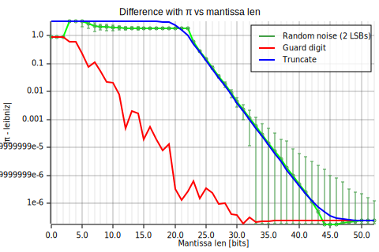

# `float-x`
 Provides a float type with selectable mantissa length

> ⚠️ This is currently just a proof of concept ⚠️

## Usage

See the [`iterate_over_precision`](./examples/iterate_over_precision.rs) example.

## Rationale

In some numerical applications, you may have to choose a particular floating point precision (e.g. **half**/**single**/**double**) and make the computations with it. However, it may be difficult to know which precision is the best for your application. You might test, for example, **single** and **double** on a smaller problem and compare the results to make sure the solution is "stable" under this choice. But what if it does not?

Let's consider this extremely simplified problem: we want to compute π with the leibniz formula using `2^25` iterations but we get:
```plain
f32: 3.141596794
f64: 3.141592623
```
Which one should we trust? (suppose we don't have an obvious mathematical way to estimate the error)

This crate provides you a way to iterate over different numbers of digits in the mantissa so that you can visually inspect dependency of the result on the precision:  
  
In this example, we see that, with 40+ digits the error tends to be stable (double precision has 53 bits in the mantissa).

You can find the corresponding code in the [leibniz](./examples/leibniz.rs) example.

### `float-x` vs Arbitrary Precision

This crate is intended to be used for research purposes, to study the dependency of the result on the numerical precision and error.  
In most cases, you might just want to use arbitrary precision numbers (e.g. using the [GMP](https://gmplib.org/) library or any of its wrappers like [rug](https://crates.io/crates/rug) or [Julia `BigFloat`](https://web.mit.edu/julia_v0.6.2/julia/share/doc/julia/html/en/manual/integers-and-floating-point-numbers.html#Arbitrary-Precision-Arithmetic-1)).
This might be the correct path for your problem but, in some very specific cases, you might want to have more control over how the actual error comes into play.  
For this reason, this crate provides a way to inject a custom behavior with the `RoundoffImpl` trait. Some provided implementations can be found in the [`roundoff` module](./src/roundoff/):
- `GuardDigit`: this gives the closest behavior to the IEEE 754 standard as all the digits are computed and then the result is rounded to the nearest representable number
- `Truncate`: this just truncates the result to the desired precision
- `SystematicNoise` (not yet implemented): adds a custom systematic noise to the result
- `RandomNoise` (not yet implemented): adds a random noise to the result

## Notes

### Max precision

Currently, the maximum precision is 52 bits for the mantissa (`f64` - double precision), in the future, we might change this limitation by making the internal representation generic and, possibly, using [`rug` (GMP)](https://crates.io/crates/rug) when higher precision are required.

> **Note**: This might be accomplished as following:
> - `Fixed<...>` will be specialized for different precisions
> - `Dynamic<Repr = GMP(or f64)>` will handle dynamic precision and the template parameter will be the internal representation (e.g. `f64` or `rug::Float`)

### Runtime precision selection

You can select the precision both at compile time and at runtime. The former might be useful to enhance performance by instantiating specialized code for some precisions.
See [`templated_len`](./examples/templated_len.rs) and [`iterate_over_precision`](./examples/iterate_over_precision.rs) examples.

> **Note**: In the future, the internal representation might be specialized for different fixed precisions.